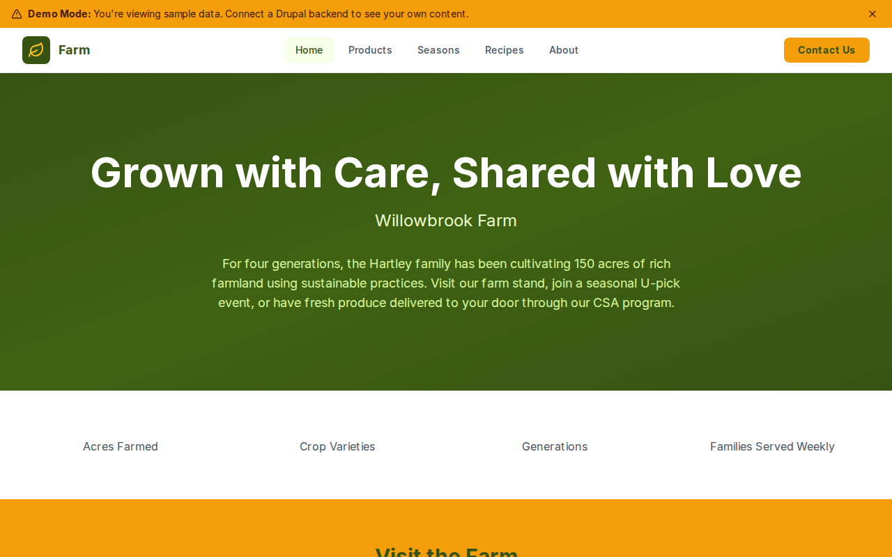

# Decoupled Farm

A family farm website starter template for Decoupled Drupal + Next.js. Built for farms, homesteads, CSA programs, and agricultural direct-to-consumer operations.



## Features

- **Farm Products** - Showcase produce, meats, eggs, honey, and artisan goods with pricing and availability
- **Seasonal Guide** - Highlight what is growing and farm activities for each season
- **Farm-to-Table Recipes** - Share recipes featuring farm products with ingredients and instructions
- **Modern Design** - Clean, accessible UI optimized for agricultural content

## Quick Start

### 1. Clone the template

```bash
npx degit nextagencyio/decoupled-farm my-farm
cd my-farm
npm install
```

### 2. Run interactive setup

```bash
npm run setup
```

This interactive script will:
- Authenticate with Decoupled.io (opens browser)
- Create a new Drupal space
- Wait for provisioning (~90 seconds)
- Configure your `.env.local` file
- Import sample content

### 3. Start development

```bash
npm run dev
```

Visit [http://localhost:3000](http://localhost:3000)

---

## Manual Setup

<details>
<summary>Click to expand manual setup steps</summary>

### Authenticate with Decoupled.io

```bash
npx decoupled-cli@latest auth login
```

### Create a Drupal space

```bash
npx decoupled-cli@latest spaces create "My Farm"
```

Note the space ID returned. Wait ~90 seconds for provisioning.

### Configure environment

```bash
npx decoupled-cli@latest spaces env 1234 --write .env.local
```

### Import content

```bash
npm run setup-content
```

This imports:
- Homepage with hero, stats, and featured products
- 4 Farm Products (Heirloom Tomatoes, Pasture-Raised Eggs, Raw Honey, Grass-Fed Beef)
- 4 Seasons (Spring, Summer, Fall, Winter) with activities and crop lists
- 3 Farm-to-Table Recipes (Caprese Salad, Vegetable Frittata, Honey Lavender Cake)
- 2 Static Pages (About, Visit the Farm)

</details>

## Content Types

### Product
- **product_category**: Category (Vegetables, Fruits, Eggs & Dairy, Meat & Poultry, etc.)
- **price**: Product price
- **unit**: Unit of sale (per pound, per dozen, etc.)
- **available**: Whether the product is currently in stock
- **growing_method**: How the product is grown or raised (Certified Organic, Pasture-Raised, etc.)
- **image**: Product photo
- **featured**: Whether the product is featured on the homepage

### Season
- **start_month / end_month**: When the season begins and ends
- **whats_growing**: List of crops available during the season
- **farm_activities**: Activities visitors can enjoy during the season
- **image**: Seasonal farm photo

### Recipe
- **prep_time / cook_time**: Preparation and cooking times
- **servings**: Number of servings
- **ingredients**: List of ingredients
- **recipe_category**: Category (Breakfast, Salads, Main Course, Desserts, etc.)
- **image**: Photo of the finished dish

## Customization

### Colors & Branding
Edit `tailwind.config.js` to customize colors, fonts, and spacing.

### Content Structure
Modify `data/farm-content.json` to add or change content types and sample content.

### Components
React components are in `app/components/`. Update them to match your design needs.

## Demo Mode

Demo mode allows you to showcase the application without connecting to a Drupal backend.

### Enable Demo Mode

```bash
NEXT_PUBLIC_DEMO_MODE=true
```

### Removing Demo Mode

1. Delete `lib/demo-mode.ts`
2. Delete `data/mock/` directory
3. Delete `app/components/DemoModeBanner.tsx`
4. Remove `DemoModeBanner` from `app/layout.tsx`
5. Remove demo mode checks from `app/api/graphql/route.ts`

## Deployment

### Vercel (Recommended)
[](https://vercel.com/new/clone?repository-url=https://github.com/nextagencyio/decoupled-farm)

### Other Platforms
Works with any Node.js hosting platform that supports Next.js.

## Documentation

- [Decoupled.io Docs](https://www.decoupled.io/docs)
- [Next.js Documentation](https://nextjs.org/docs)
- [Drupal GraphQL](https://www.decoupled.io/docs/graphql)

## License

MIT
